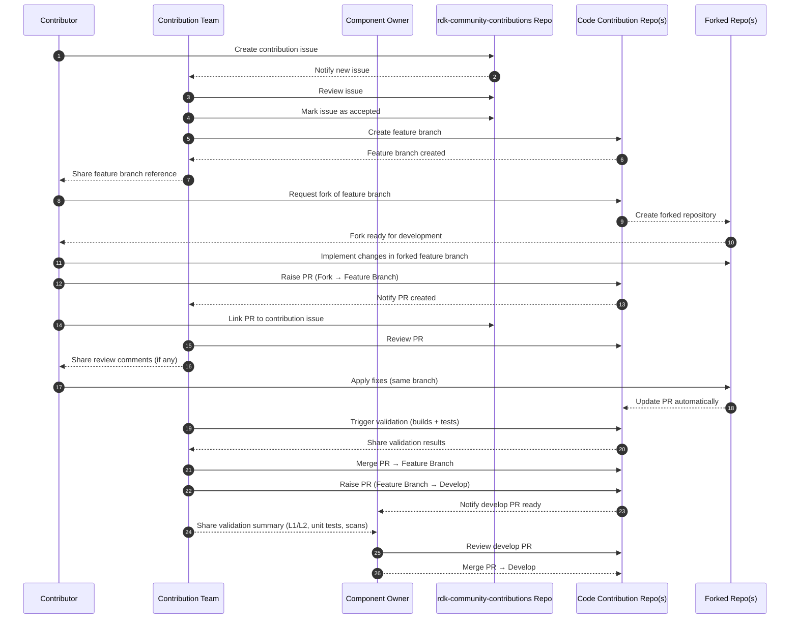
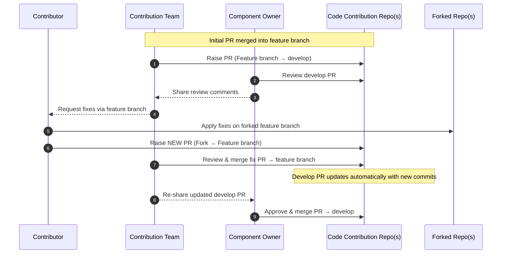

# Community Contribution Process

## Community Contribution Process

### GitHub Issue–Driven Contribution Model:

### Purpose

This document describes the community contribution process agreed for accepting external contributions into monitored GitHub repositories, based on Feature-branch-first model.

The objective of this process is to:

- Enable community contributions in a controlled and secure manner
- Ensure consistency, traceability, and quality across repositories
- Address CI, security, and compliance constraints inherent to fork-based contributions
- Ensure an open, inclusive, and well‑structured experience that makes collaboration smooth for contributors and maintainers alike

This process uses a GitHub Issue as the single-entry point for all community contributions.

---

## Guiding Principles

- Community contributors do not have write access to the RDKCENTRAL repositories.
- All contributions must be tracked, reviewed, and validated before merging into develop branch.
- CI, security scans, and integration builds must run only on trusted branches.
- The process should remain predictable, auditable, and scalable as contribution volume grows.
- GitHub issues will be the standard way of tracking GitHub contributions (needs discussion)

---

## Technical Rationale for the Feature-Branch-First Model:

The feature-branch-first model introduces a controlled integration layer between external contributions and the main development branch (develop), enabling structured validation and governance.

By routing all contributions through a dedicated feature branch, the workflow ensures that:

- Changes are isolated from active development until they pass review and validation.
- Multi-repository contributions can be coordinated and tested together before promotion.
- CI/CD pipelines, security scans, and compliance checks can be executed without exposing sensitive infrastructure.
- Dependency alignment and integration risks are reduced prior to merging into develop.
- Rollback and recovery are simpler, as incomplete or failing changes remain contained.

---

## Entry Point: GitHub Issue

Every community contribution starts with the creation of a GitHub Issue using a standardized Issue Form.

The GitHub Issue serves as:

- The formal request for a contribution
- The agreement on scope, base tags, and repositories involved
- The tracking mechanism throughout the contribution lifecycle

All contributions must begin with a GitHub Issue that is reviewed and approved before any code is submitted. This ensures early alignment on scope, ownership, and expectations.

---

## Community Issue Repository for Contributions

To simplify the contribution process and ensure consistent tracking, the community uses a community issue repository: rdk-community-contributions for all incoming contributions.

All contributors should create their GitHub Issue in the designated Community Issue Repository:

**rdkcentral/rdk-community-contributions**

This repository serves as the single-entry point and system of record for contribution tracking, regardless of how many component repositories are involved.

---

## Why a Community Issue Repository Is Used

Using a single, default anchor repository provides the following benefits:

- A clear and predictable starting point for all contributors
- Centralized triage, prioritization, and discussion
- Easier cross-repository coordination and review
- Reduced duplication of issues across repositories

---

## How Contributions Are Tracked Using the Community Issue Repository

- One GitHub Issue is created in the rdk-community-contributions repository
- This issue captures all the required mandatory fields
- All pull requests raised in individual component repositories must reference this GitHub issue
- Example: “Related to rdkcentral/rdk-community-contributions#123”

The GitHub issue remains the single source of truth throughout the lifecycle of the contribution.

---

## Contributions Involving Multiple Repositories

For contributions that span multiple repositories:

- Do not create separate issues in each component repository
- Use the same GitHub issue to track the entire contribution
- Link all related pull requests back to the GitHub issue

This ensures reviewers and maintainers have a complete, end-to-end view of the change.

---

## Friendly Reminder to Contributors

Creating the issue in the rdk-community-contributions repository helps the Contribution Intake Team respond faster and more consistently.

---

## Types of Contributions

### Bug Fixes

Community members are encouraged to fix bugs and help improve the stability and reliability of the project.

Bug GitHub Issues are reviewed by the Contribution Intake Team. Once validated, contributors are invited to submit a fix.

Please note: Submitting a bug fix does not automatically guarantee immediate resolution. All bug issues are reviewed, and acceptance is based on technical validity, impact, and project priorities.

Contributors are welcome to provide fixes, test cases, or additional diagnostics to help move the issue forward.

---

### Feature Contributions

Community members are welcome to propose new features that help enhance and evolve the project. We value ideas that improve functionality, usability, performance, or long-term maintainability.

Feature requests are reviewed during RTAB meetings and considered alongside the project roadmap and available community bandwidth. Active participation and familiarity with the project can help reviewers better assess feasibility and alignment.

Please note: Submitting a feature request does not guarantee acceptance or prioritization.

---

### Improvement & Enhancement Contributions

Improvement and enhancement contributions such as refactoring, code simplification, documentation updates, build improvements, or removal of unused code—are highly appreciated. These contributions help keep the project healthy, maintainable, and easier for everyone to work with.

Cleanup contributions are reviewed to ensure they do not introduce regressions or unintended side effects. In some cases, reviewers may suggest breaking large cleanups into smaller, incremental changes to make review easier.

Please note: Even though cleanup contributions may not add new features, they still follow the same review and approval process to maintain project quality.

Contributors are encouraged to include tests, documentation updates, or before-and-after explanations where applicable.

---

## GitHub Issue Template – Required Fields

To help reviewers quickly understand your contribution, we encourage you to provide the details listed below. Unless explicitly marked optional, these fields give the necessary context for triage, review, and merging.

### Mandatory Fields

| Field Name | Field Description |
|----------|------------------|
| Type of Contribution | Select the issue type that best describes your contribution: • Bug Fix • Feature • Improvement/Enhancement |
| Summary | A short, clear summary describing the contribution. This helps reviewers quickly understand the intent. |
| Description | A detailed explanation of the problem being addressed or the enhancement being proposed. Provide sufficient context for reviewers. |
| Repositories Involved | List all GitHub repositories impacted by this contribution, including any related meta-layers or manifests. |
| Base Tag for Repositories | Specify the base branch or tag for each repository involved in the contribution.  As a general guideline, contributors are encouraged to use the default or currently active development branch for the repository (for example: main or develop), unless there is a specific reason to target a different branch or release tag.  Friendly Note to Contributors: If you are unsure which base branch or tag to use, start with the default or active branch—the Contribution Intake Team will guide you during review if an adjustment is required. |
| Steps to Reproduce / Acceptance Criteria | This section helps reviewers understand the expected behavior and validate the contribution effectively. The level of detail depends on the contribution type:  For bug fixes: Provide clear, repeatable steps to reproduce the issue so reviewers can confirm the problem and verify the fix.  For feature contributions: Define clear acceptance criteria describing when the feature should be considered complete. This may include functional behavior, edge cases, and expected outputs.  For improvement or enhancement contributions: Describe the current behavior or structure and explain what is being improved. Where applicable, include: • What is changing and what is intentionally not changing • Expected improvements (e.g., readability, maintainability, performance) • How reviewers can validate that existing behavior remains unchanged.  If the change is behavior-neutral, please explicitly state that there is no functional impact. |
| Test Cases | Describe the test scenarios used to validate the change. Include both positive and negative cases where applicable. |
| Expected Result | Describe the expected behavior after the change is applied. |
| Actual Result | Required for bug reports. Describe the current or incorrect behavior observed before the fix. |
| Test Reports | Provide links or attachments to any available test results. Screenshots or logs are encouraged where relevant. |

---

## Mandatory Labels

- Labels: community-contribution.
  Contributors must ensure that the community-contribution label is applied to the GitHub Issue when it is created.

---

## Contribution Workflow:

### Standard Workflow:

### Standard Contribution Workflow – Step-by-Step Explanation:

The following steps outline the agreed contribution workflow once a GitHub Issue is created.

---

## Phase 1: Contribution Intake & Approval

**Step 1 – Contributor Creates Contribution Issue**  
Actor: Contributor  
The contributor submits a new contribution issue in the Project Community Repository describing the proposed change.

**Step 2 – System Notifies Contribution Intake Team**  
Actor: Project Community Repo (System)  
The system automatically notifies the Contribution Intake Team about the newly created issue.

**Step 3 – Contribution Intake Team Reviews Issue**  
Actor: Contribution Intake Team  
The team evaluates the issue for:
- Scope alignment
- Completeness
- Compliance
- Relevance to roadmap

**Step 4 – Issue Marked as Accepted**  
Actor: Contribution Intake Team  
If approved, the issue is marked as Accepted, formally allowing development to proceed.

**Step 5 – Feature Branch Creation**  
Actor: Contribution Intake Team  
A dedicated feature branch is created in the Code Contribution Repository.

**Step 6 – System Confirms Branch Creation**  
Actor: Code Contribution Repo (System)  
The repository confirms successful creation of the feature branch.

**Step 7 – Feature Branch Reference Shared**  
Actor: Contribution Intake Team  
The branch reference is shared with the Contributor for development.

---

## Phase 2: Fork Creation & Development

**Step 8 – Contributor Requests Fork**  
Actor: Contributor  
The contributor initiates a fork request of the feature branch.

**Step 9 – Forked Repository Created**  
Actor: Code Contribution Repo (System)  
A forked repository is created under the contributor’s namespace.

**Step 10 – Fork Ready Notification**  
Actor: Forked Repo (System)  
The contributor is notified that the fork is ready for development.

**Step 11 – Development in Fork**  
Actor: Contributor  
The contributor implements required changes in the forked feature branch.

---

## Phase 3: Pull Request to Feature Branch

**Step 12 – Pull Request Raised**  
Actor: Contributor  
A Pull Request (PR) is raised from the forked repository to the feature branch.

**Step 13 – PR Notification to Contribution Intake Team**  
Actor: Code Contribution Repo (System)  
The Contribution Intake Team is automatically notified of the new PR.

**Step 14 – PR Linked to Contribution Issue**  
Actor: Contributor  
The PR is linked to the original contribution issue for traceability.

---

## Phase 4: Review, Iteration & Validation (Feature Branch)

**Step 15 – PR Review Initiated**  
Actor: Contribution Intake Team  
The team reviews the PR for:
- Code quality
- Design adherence
- Security considerations
- Coding standards

**Step 16 – Review Comments Shared (If Any)**  
Actor: Contribution Intake Team  
If changes are required, comments are shared on the PR.

**Step 17 – Contributor Applies Fixes**  
Actor: Contributor  
The contributor updates the same branch in the forked repository addressing review comments.

**Step 18 – PR Automatically Updated**  
Actor: Forked Repo → Code Contribution Repo (System)  
The PR reflects updated commits automatically.

**Step 19 – Validation Pipeline Triggered**  
Actor: Contribution Intake Team  
Build and validation pipelines are triggered (L1/L2 tests, scans, unit tests).

**Step 20 – Validation Results Returned**  
Actor: CI System / Repository (System)  
Validation results are generated and shared with the Contribution Intake Team.

**Step 21 – PR Merged to Feature Branch**  
Actor: Contribution Intake Team  
Upon successful validation and review completion, the PR is merged into the feature branch.

---

## Phase 5: Integration to Develop Branch

**Step 22 – PR Raised (Feature → Develop)**  
Actor: Contribution Intake Team  
A new PR is created from the feature branch to the Develop branch.

**Step 23 – Develop PR Notification**  
Actor: Code Contribution Repo (System)  
The Component Owner is notified of the Develop PR.

**Step 24 – Compliance Summary Shared**  
Actor: Contribution Intake Team  
Validation results and compliance checks are shared with the Component Owner.

**Step 25 – Component Owner Reviews Develop PR**  
Actor: Component Owner  
The Component Owner performs final technical and architectural review.

**Step 26 – Merge to Develop**  
Actor: Component Owner  
Upon approval, the PR is merged into the Develop branch, completing the workflow.

---

## Why This Model Is Used

This model intentionally separates untrusted contributor code from trusted CI execution.

GitHub security restrictions prevent secret-based workflows from running on forked pull requests. By merging reviewed code into internal feature branches first, the project ensures:

- Secure access to CI secrets
- Accurate integration testing
- Compliance with scanning and licensing requirements

---

## Expectations from Contributors

- Provide complete and accurate issue information
- Follow feedback and review comments constructively
- Submit relevant test cases alongside code
- Keep pull requests focused and scoped to the approved issue

---

## Expectations from the Contribution Intake Team

- Timely issue triage and communication
- Clear guidance on feature branch details and workflow guidance
- Transparent review feedback and working with Component Owner to get the PRs reviewed and merged.

---

## Exception Workflow:

Review Comments Received on Develop PR (Post-Feature Merge)

---

## Roles & Responsibilities

The table below clearly defines ownership at each stage of the contribution lifecycle to avoid ambiguity.

- R = Responsible (performs the work)
- A = Accountable (final decision authority)
- C = Consulted
- I = Informed

| Activity | Contributor | Contribution Intake Team | Component Owner |
|--------|------------|--------------------------|-----------------|
| 1. Create Contribution Issue | R | I | I |
| 2. Review & Accept Issue | I | R / A | C |
| 3. Create Feature Branch | I | R / A | I |
| 4. Share Feature Branch Details | I | R | I |
| 5. Fork Feature Branch | R | I | I |
| 6. Implement Code Changes | R | I | I |
| 7. Raise PR (Fork → Feature) | R | I | I |
| 8. Link PR to Issue | R | I | I |
| 9. Review PR (Feature Branch) | I | R / A | C |
| 10. Provide Review Comments | I | R | C |
| 11. Address Review Comments | R | I | I |
| 12. Validate Builds | I | R / A | I |
| 13. Merge PR to Feature Branch | I | R / A | I |
| 14. Raise PR (Feature → Develop) | I | R | I |
| 15. Share Validation Summary | I | R | I |
| 16. Review Develop PR | I | C | R / A |
| 17. Merge PR to Develop | I | I | R / A |

---

## Closing Notes

This process is designed to balance open collaboration with security, quality, and maintainability. Feedback on the process itself is welcome and encouraged, and improvements will be made as the contribution ecosystem evolves.

Thank you for supporting a healthy and scalable community contribution model.
