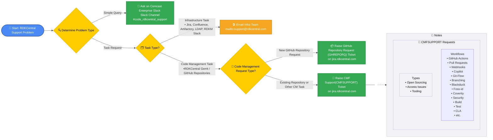

# RDKCentral Code Management Facility (CMF) – High‑Level Support Process

Audience: Community

## 1. Overview
There are two RDKCentral teams providing support to the community.

1. Infrastructure Team (Infra) - Responsible for Jira / Confluence / Artifactory, RDKCentral Accounts, LDAP and RDKM Slack **Infrastructure**.
2. Code Management Facility Team (CMF) - Responsible for providing support for all issues related to **Code Management** within the RDKM ecosystem.

**The following is an overview of the workflow to follow if you have a RDKCentral support request or issue:**

## 2. RDKCentral Support Responsibilities

### 2.1 RDKCentral CMF Support Scope
The CMF team handles issues related to repositories on RDKCentral:
- New repository requests. 
- Repository access requests.
- Branch access issues.
- RDKCentral Open Sourcing
- Coverity Integrations.
- Workflows
    -  GitHub Actions, Pull Requests, Webhooks, Copilot, Git‑Flow, Branching, Blackduck, Foss‑id, Coverity, CodeQL, Security, Build, Test, CLA, etc.
- Tooling 
- General repository maintenance or changes.
             
The CMF Team have created some useful FAQs and Guides that should be referenced if you are experiencing issues or or have workflow requests on GitHub. These are:

**FAQs**
- [RDKCentral New Repository And Repository Access FAQ](https://github.com/rdkcentral/docs/wiki/rdkcentral-new-repository-and-repository-access-request-FAQ)
- [RDKCentral GitHub Access Issues FAQ](https://github.com/rdkcentral/docs/wiki/rdkcentral-github-access-issues-FAQ)
- [RDKCentral GitHub Coverity Integration FAQ](https://github.com/rdkcentral/docs-internal/wiki/coverity_faq) (_Internal_)

**Guides**
- [RDKCentral GitHub Profile Setup For Elevated and Private Repository Privileges](https://github.com/rdkcentral/docs/wiki/rdkcentral-github-profile-setup-for-private-repo-access)
- [RDKCentral Opensourcing Guidelines](https://github.com/rdkcentral/docs/wiki/opensource-guidelines)
- [RDKCentral Community Opensourcing Process](https://github.com/rdkcentral/docs/wiki/community-opensourcing-process)
- [RDKCentral Internal Opensourcing Process](https://github.com/rdkcentral/docs-internal/wiki/internal-opensourcing-process) (_Internal_)

> **Note:** If your support request requires implementation work, a **ticket must be created** to allow for planning and tracking.

### 2.2 RDKCentral Infrastructure Support Team Scope
For non-repository infrastructure systems on RDKCentral, contact the **Infra Support Team**.  
RDKCentral infrastructure support issues relate to:
- RDKCentral Accounts / Single Sign On Login
- Confluence/Wiki.  
- Jira.  
- LDAP.  
- Artifactory.
- RDKM Slack. 

**Contact Email:**  
support@rdkcentral.com

## 3. How to Raise Requests

### 3.1 New RDKCentral GitHub Repository Requests
Submit new repository requests via the **GHREPOREQ** Jira tracker:

[GHREPOREQ](https://jira.rdkcentral.com/jira/issues/?jql=project%20%3D%20GHREPOREQ)

### 3.2 All Other RDKCentral Repository‑Related Requests
For all other repository or CMF-related issues (access, branches, workflows, etc.), submit a ticket via the **CMFSUPPORT** tracker:

[CMFSUPPORT](https://jira.rdkcentral.com/jira/issues/?jql=project%20%3D%20CMFSUPPORT)

## 4. RDKCentral Communication Channels

### 4.1 Slack
General questions may be asked in the Comcast Slack channel:

- [#code_rdkcentral_support](https://comcast.enterprise.slack.com/archives/C055S2RGYD6)

>  Directly messaging CMF team members is **not** a supported communication method.

### 4.2 Email (RDKCentral Infrastructure Issues Only)
Use email only for Infra-related issues:

Email: support@rdkcentral.com

## 5. RDKCentral Ticket Requirement
Any issue requiring implementation, repository changes, workflow updates, or configuration work **must** have a corresponding ticket so the CMF team can properly plan and track the work.
